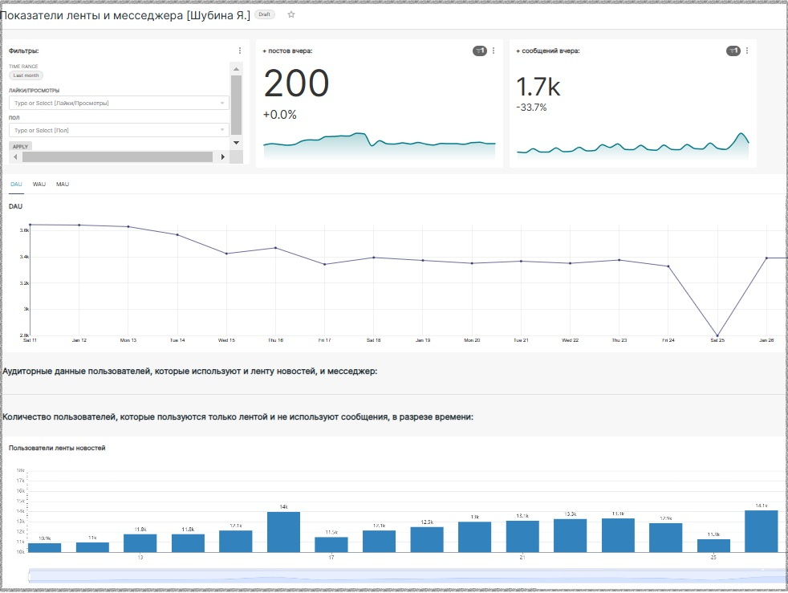

# 📊 Примеры созданных дашбордов 

## Superset 
**Superset - Общие показатели**

**Superset анализ удержания пользователей RR**

**Superset - Мониторинг**

## PBI

  

## Yandex DataLens  

  

  

  

## Google Sheets 
**Пример автоматического отчета**

**При отправке сообщения в телеграмм канал с суммой, в файле google sheets обновлояется отчет**

## PBI

  

